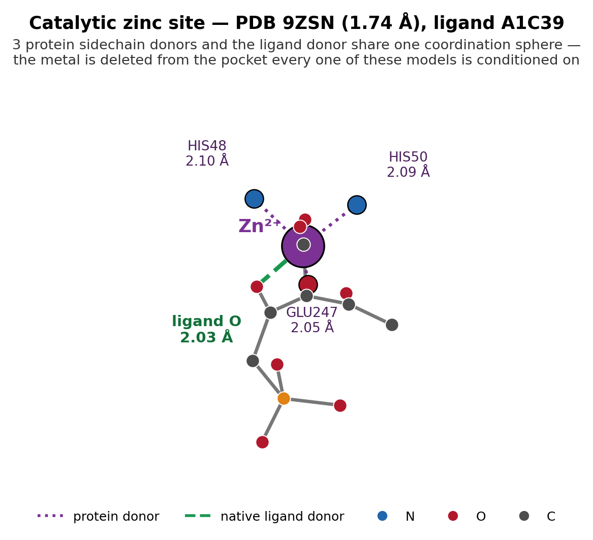
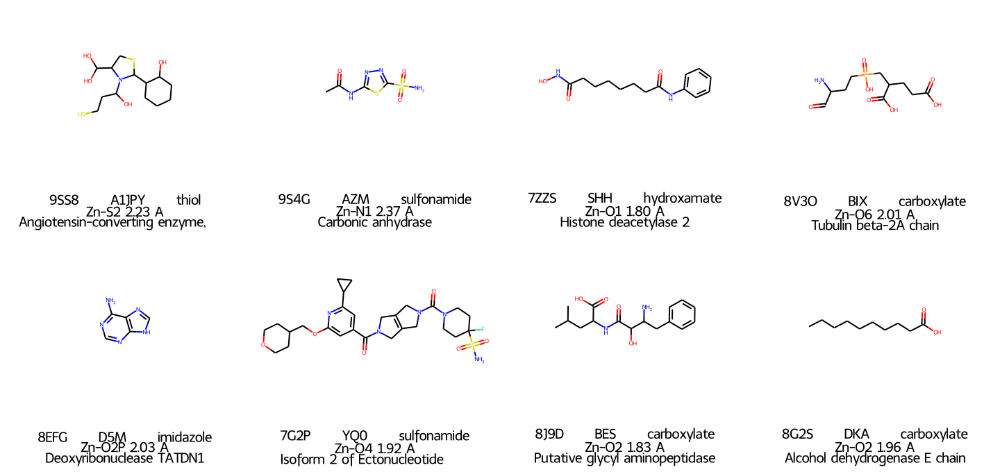
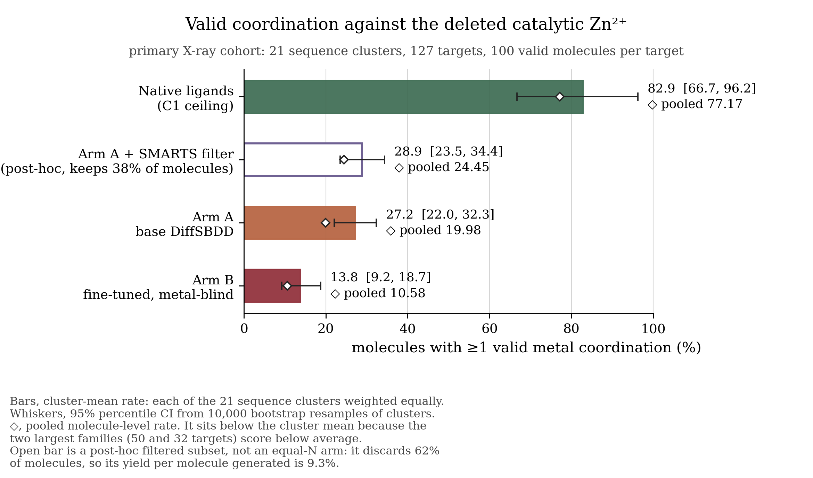
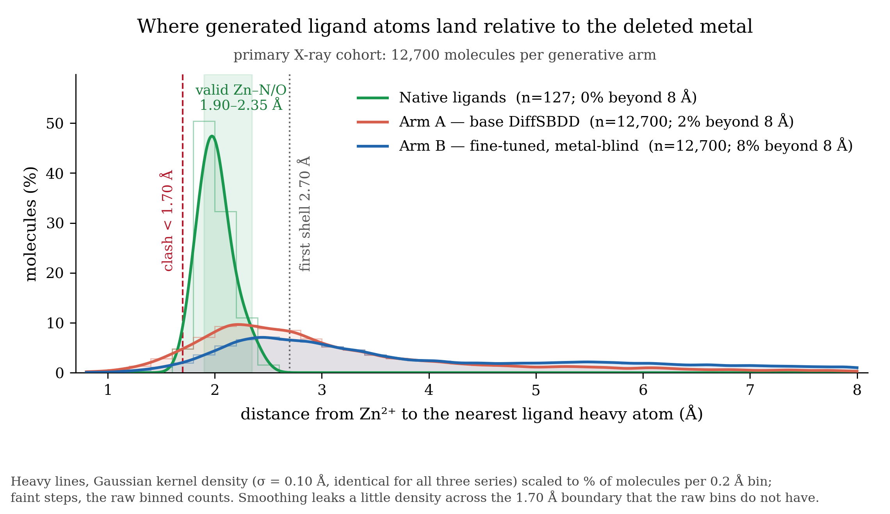
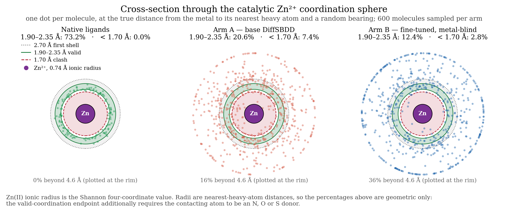

# Metal-Aware Structure-Based Drug Design (`metal-aware-sbdd`)

[](DiffSBDD/LICENSE)
[](https://www.python.org/downloads/)
[](https://pytorch.org/)

> Pocket-conditioned 3D generative models delete catalytic metal ions during preprocessing.
> This repository measures the resulting coordination failures with a checker no existing
> benchmark provides, and tests whether restoring the metal to the pocket representation —
> rather than merely fine-tuning on more metalloprotein data — repairs them.

<p align="center">
  
</p>

---

## The bug, verified by reading source

Metal ions are `HETATM` records with resnames `ZN`, `MG`, `FE`, `MN`, `CA`, `CU`. Every
pocket-extraction filter in the CrossDocked lineage removes them:

| Model | Preprocessing filter | Location | Metal in pocket? |
|---|---|---|:---:|
| **DiffSBDD** | `is_aa(resname, standard=True)` | `process_crossdock.py:54` | no |
| **TargetDiff** | `if line[0:6].strip() == 'ATOM':` | `utils/data.py` | no |
| **Pocket2Mol** | `if line[0:6].strip() == 'ATOM':` | `utils/protein_ligand.py` | no |

DiffSBDD is the stricter case: the checkpoint used here also has no metal entry in its
pocket vocabulary (`dataset_params['crossdock']['atom_encoder']`, ten elements, closed set).

**Precision matters.** TargetDiff and Pocket2Mol resolve elements through RDKit's periodic
table and *could* represent zinc if handed it. The binding constraint is the record filter,
not the element vocabulary. The defensible claim is *"metal ions never reach the model"* —
never *"these models cannot represent metals."*

The lineage is live, not historical: MolCRAFT and DrugFlow reuse the same preprocessed
`crossdocked_pocket10` files and independently filter metals through their own vocabularies.

---

## What this repository adds

### 1. A metal-coordination checker (`scripts/coordination_checker.py`)

PoseBusters checks conformation, strain and clashes; GenBench3D checks conformer quality.
Neither checks coordination. This one scores, per generated molecule, against the metal the
model never saw:

- **V1** hard clash — any ligand heavy atom within **1.70 Å** of the metal centre;
- **V2** shell occupancy — an atom inside the **2.70 Å** first shell that is not a valid donor;
- **valid coordination** — donor element N/O/S at a distance inside a per-pair window
  (Zn–N 1.90–2.35 Å, Zn–O 1.85–2.30 Å, Zn–S 2.15–2.50 Å, and equivalents for Mg/Mn/Fe/Ca/Cu);
- **angular RMS deviation** from ideal tetrahedral / trigonal-bipyramidal / octahedral geometry,
  computed over the **combined** coordination sphere — the protein sidechain donors plus
  whatever the ligand contributes, because that is the chemically meaningful unit;
- chelate-aware strict variants of V2 and the primary endpoint.

Unit tests for the geometry live in `tests/test_coordination_checker.py`.

### 2. A strictly filtered external zinc benchmark

133 catalytic-zinc targets in **26 independent 30%-sequence-identity clusters**, curated to be
disjoint from CrossDocked training data, with resolution, mutant and ligand-quality filters, and
a per-target list of protein sidechain donors. Headline analyses run on the pre-registered
primary X-ray stratum (m=21 clusters, n=127 targets); six cryo-EM targets are reported
separately.

<p align="center">
  
</p>

*One native ligand per sequence cluster, spanning five zinc-binding-group classes.*

### 3. A four-arm ablation that isolates cause

| Arm | Metal in pocket | Metal atom types | Fine-tuned | Isolates |
|---|:---:|:---:|:---:|---|
| **A** | no | no | no | the status quo |
| **B** | no | no | yes, on metalloproteins | is it just a data problem? |
| **C** | yes | yes | yes (LoRA + new vocabulary rows) | is it a representation problem? |
| **D** | yes | yes | yes + inference-time constraint | does geometry need explicit enforcement? |

Arm B decides the paper's claim. If more metalloprotein data through the same metal-blind
representation closes the gap, the finding is mundane. If it does not and Arm C does, the
representation is the bug — and it is inherited across the field.

---

## Results so far

All rates below are recomputed directly from the checker output on the primary X-ray cohort
(12,700 molecules per generative arm, 100 valid molecules per target) by
`docs/figures/make_readme_figures.py`, so the figures cannot drift from the underlying data.

<p align="center">
  
</p>

| Endpoint | Native ligands (C1) | Arm A (base) | Arm B (fine-tuned, metal-blind) |
|---|---:|---:|---:|
| Valid coordination rate | **77.17%** | 19.98% | 10.58% |
| Primary violation (V1∨V2) | 20.47% | 18.38% | 11.39% |
| V2-strict (chelate-aware) | 2.36% | 14.80% | 9.69% |
| V1 hard clash (<1.70 Å) | 0.00% | 7.38% | 2.81% |
| Mean valid coordinations / molecule | 0.874 | 0.215 | 0.110 |
| Angular RMSD to ideal geometry | 18.04° | 25.28° | 26.90° |

**Step 1 — the failure is real and specific.** Generated ligands coordinate the catalytic zinc
validly in 19.98% of molecules against a 77.17% native ceiling (GEE odds ratio 0.075,
p = 5.3 × 10⁻⁶, cluster-clustered). Angular deviation stays near 25° even when a donor does land
in the shell. The paired protein-atom control (C2) shows the failure is metal-specific, not
general geometric sloppiness: the same molecules clash with ordinary pocket protein atoms two
orders of magnitude less often.

**One Step 1 result did *not* confirm, and is reported as such.** The burial-matched decoy
control (C3) came in at 1.181× metal-site vs decoy occupancy with a paired CI crossing zero, and
the measured σ_d (0.2998) exceeded the pre-registered σ_d ≤ 0.10 needed for a null to be
interpretable. C3 is **unresolved, not confirmatory**. The model is not preferentially homing in
on the metal site — it reproduces training-ligand density generically, and when an atom does
land near the metal, the chemistry is wrong.

**Step 2 Arm B — data scarcity falsified.** Fine-tuning on metalloprotein-enriched data through
the unmodified, metal-blind representation *lowers* the valid-coordination rate to 10.58%
(cluster bootstrap 13.79%, 95% CI [9.16%, 18.77%]), against a pre-registered falsification
threshold of ≤30%. The distance histogram shows why: the fine-tuned model does not learn to
coordinate the metal, it learns to **avoid the region**.

<p align="center">
  
</p>

The same distances, read radially instead of along an axis — a cross-section through the
coordination sphere, one dot per molecule:

<p align="center">
  
</p>

**Step 3 kill check, run early — the pre-registered threat is live.** A post-hoc SMARTS filter
for known zinc-binding groups applied to the *unmodified* base model recovers 24.45% valid
coordination among the 38% of molecules it keeps — better than Arm A's raw 19.98%. Any
representation fix has to beat this cheap baseline on rate, not only on yield per molecule
generated (where filtering costs 61% of the samples). This is pre-registered in
`docs/step3_smarts_baseline.md`.

### In progress

Arm C — metal retained in the pocket, pocket vocabulary expanded from 10 to 16 element classes
(genuinely decoupled from the 10-class ligand vocabulary, so the generator still cannot emit a
free zinc atom), first-layer surgery verified bit-identical to the base checkpoint on metal-free
pockets, LoRA adapters plus directly-trainable new vocabulary rows — is generating its 133-target
evaluation set. **No Arm C endpoint is reported here until the full cohort is scored**, against
the predictions registered in `results/step2/ANALYSIS_PLAN_ARMC.md` before any molecule was
generated.

---

## Methodological standards

- **Pre-registration.** Analysis plans, endpoints, thresholds and decision rules are committed
  before the data they judge (`results/step1/ANALYSIS_PLAN.md`,
  `results/step2/ANALYSIS_PLAN_ARMB.md`, `results/step2/ANALYSIS_PLAN_ARMC.md`). Amendments are
  dated addenda; nothing is rewritten in place.
- **Every claim carries a control that could have detected the positive.** C1 native ligands
  (is the checker's threshold merely too strict?), C2 protein-atom clash paired within molecule
  (is the model sloppy everywhere?), C3 burial-matched decoys paired within pocket (is the metal
  site special, or just buried?).
- **Detection limits stated in advance.** Minimum detectable effects are computed a priori at the
  cluster level; results below the MDE are reported as unresolved rather than as nulls.
- **Failed gates are reported with their numbers.** Step 1's primary endpoint came in at 18.38%
  against a registered >30% prediction, and C3 did not confirm. Both are in the results
  documents.
- **Corrections are visible.** Where a reported figure could not be reproduced from the raw
  checker output, the file carries a dated correction block rather than a silent edit.

Hardware: everything here runs on a single 8 GB consumer GPU and 32 CPU cores.

---

## Repository layout

```
metal-aware-sbdd/
├── DiffSBDD/                        # vendored upstream DiffSBDD (see MODIFICATIONS.md)
├── scripts/
│   ├── coordination_checker.py      # the metal coordination checker
│   ├── measure_c2_clash.py          # C2 control: protein-atom clash, paired within molecule
│   ├── measure_c3_occupancy.py      # C3 control: burial-matched decoy occupancy
│   ├── build_*_zn_*.py              # benchmark curation and leakage audits
│   ├── generate_step1.py            # generation harness (any arm's checkpoint)
│   ├── train_arm_b.py / train_arm_c.py, lora.py
│   ├── build_arm_c_surgery.py, verify_arm_c_surgery.py, verify_arm_c_gradient_flow.py
│   ├── run_smarts_baseline.py       # pre-registered post-hoc ZBG filter kill check
│   └── run_arm_b_analysis.py, evaluate_step2_glmm.py, run_step1_analysis.py
├── results/
│   ├── step0/GATE_CHECKS.md         # scale and leakage gates
│   ├── step1/                       # Arm A: analysis plan, results, C1 control, run manifest
│   └── step2/                       # Arm B and Arm C: plans, training logs, evaluations
├── docs/
│   ├── figures/                     # figures used above, and the script that regenerates them
│   └── step3_smarts_baseline.md     # kill-check record
├── tests/test_coordination_checker.py
└── MODIFICATIONS.md                 # every deviation from vendored upstream DiffSBDD
```

Large artifacts (checkpoints, LMDBs, `.pt` datasets, generated SDFs, per-molecule JSONL) are
deliberately untracked; the scripts regenerate them.

---

## Getting started

```bash
conda env create -f DiffSBDD/environment.yaml
conda activate diffsbdd
```

Interaction-fingerprint and statistics steps use separate environments (`ifp`,
`atomica-interface`) to keep ProLIF/MDAnalysis and `statsmodels` away from the pinned
`torch==2.0.1` build.

Score any set of generated ligands against their targets' metals:

```bash
python scripts/coordination_checker.py \
  --targets data/external_zn_test_clean.pt \
  --sdf-dir results/step1/generation/sdf \
  --source generated \
  --protein-donors data/protein_donors.json \
  --out results/step1/checker/generated.jsonl
```

Regenerate the figures in this README from the checker output:

```bash
python docs/figures/make_readme_figures.py
```

---

## Credit and licence

`DiffSBDD/` is vendored from [arneschneuing/DiffSBDD](https://github.com/arneschneuing/DiffSBDD)
at commit `5d0d38d`, MIT licensed; `MODIFICATIONS.md` records every deviation. Project code is
released under the same [MIT licence](DiffSBDD/LICENSE).
